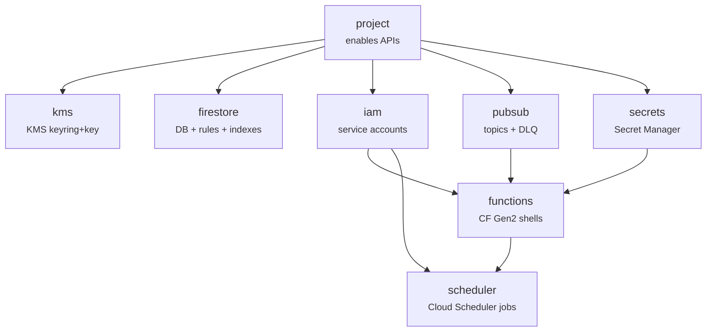
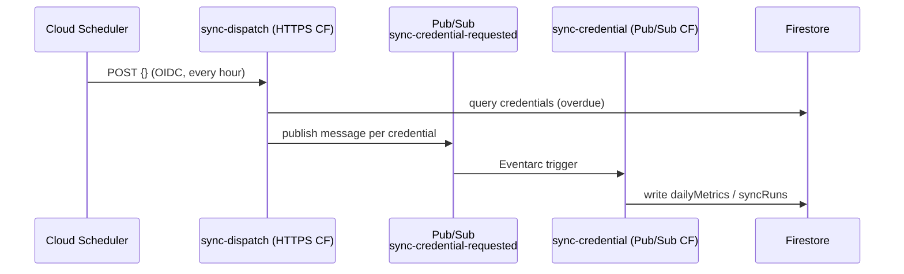

# fafa-iac Architecture

Infrastructure provisioning for **SiveraV2** on GCP/Firebase (`fafa-255a2`, `asia-northeast3`).

## Module dependency graph

## Sync pipeline (runtime, not Terraform)

## IAM matrix

| Identity | Role | Scope |
|----------|------|-------|
| `sa-sync-runner` | `roles/datastore.user` | project |
| `sa-sync-runner` | `roles/secretmanager.secretAccessor` | each secret |
| `sa-sync-runner` | `roles/pubsub.publisher` | `sync-credential-requested`, `fcm-send-requested` |
| `sa-scheduler-invoker` | `roles/run.invoker` | sync-dispatch, cleanup, expire-trials Cloud Run services |
| `sa-vercel-app` | `roles/datastore.viewer` | project |
| `sa-vercel-app` | `roles/iam.serviceAccountTokenCreator` | self (to mint OIDC tokens) |
| `sa-vercel-app` | `roles/run.invoker` | sync-on-connect Cloud Run service |
| Build SA (`<num>-compute`) | `roles/storage.objectViewer` | artifact bucket |
| Build SA (`<num>-compute`) | `roles/artifactregistry.reader` | project |

## State backend

GCS bucket: `gs://fafa-tf-state/fafa-iac/` (versioned, `asia-northeast3`).
Run `scripts/bootstrap-state-bucket.sh` once if the bucket doesn't exist.

## Terraform version requirements

| Component | Version |
|-----------|---------|
| Terraform | `>= 1.6.0` |
| `hashicorp/google` | `~> 6.11` |
| `hashicorp/google-beta` | `~> 6.11` |
| `hashicorp/archive` | `~> 2.4` |
| `hashicorp/time` | `~> 0.12` |
